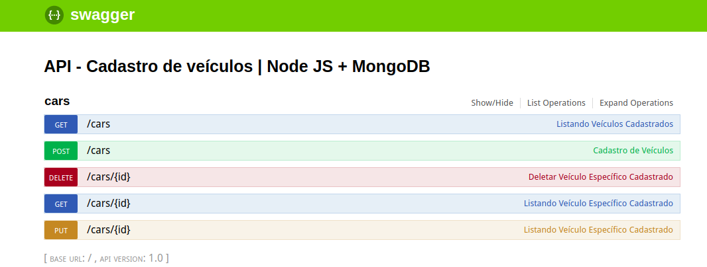

## API: &nbsp; Node JS - Hapi & Hapi-Swagger - Mongo DB

CRUD API Veículos

API básica de cadastramento e gerenciamento de veículos.  
Nessa API é possível fazer todas as operações do CRUD (Listar, Inserir, Editar & Deletar um veículo).

`Para Funcionar:`  
1º - NPM install ao clonar o repositório p/ baixar as dependencias;  
2º - Mudar string de conexão do mLab (Banco de dados) no arquivo mongo.js na pasta ./Services  
3º Via linha de comando (cmd) navegar até a pasta do projeto e executar: &nbsp; <b>`node index`</b>

Observações:  

- Como feito no código o servidor irá subir na porta 8000 | localhost:8000
- Para acessar a documentação basta acessar a url &nbsp; <b>`http://localhost:8000/documentation`</b>
- Caso queira fazer requisições diretas, só pegar a rota é bater via url - Exemplo: <b>`http://localhost:8000/cars`</b>

<b> Página de documentação ficará assim: </b>

